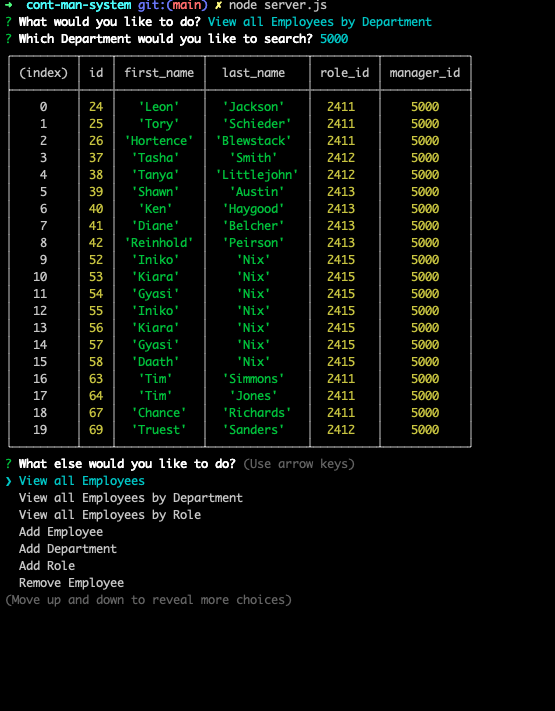

# Content Management System

## Table of Contents
[Description](#description) 
[Tools Used](#tools-used) 
[Capabilities](#capabilities) 
[Screenshots](#screenshots) 
[Questions](#questions)

---
## Description

This web application will create interfaces that make it easy for non-developers to view and interact with information stored in databases and provide a solution for managing a company's employees.

## Tools Used
* **mysql** NPM package to connect to your MySQL database and perform queries
* **inquirer** NPM package to interact with the user via the command-line.
* **console.table** NPM package to print mysql rows to the console.

## Capabilities
The app can perform the following functions:
* View all Employees
* View all Employees by Department
* View all Employees by Role
* Add Employees
* Remove Employee
* Add Role
* View Roles
* Remove Roles
* View Departments
* View Payroll by Title

##  Screenshots

## Questions
Please feel free to contact me w/any questions. 
**Geoff Nix**  
**FullStackGeoff@gmail.com** 
**(347)727-1956**
